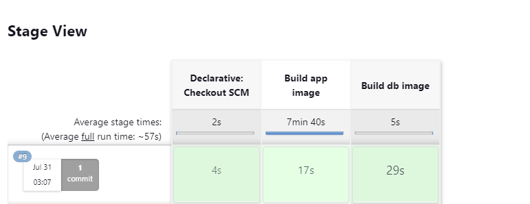
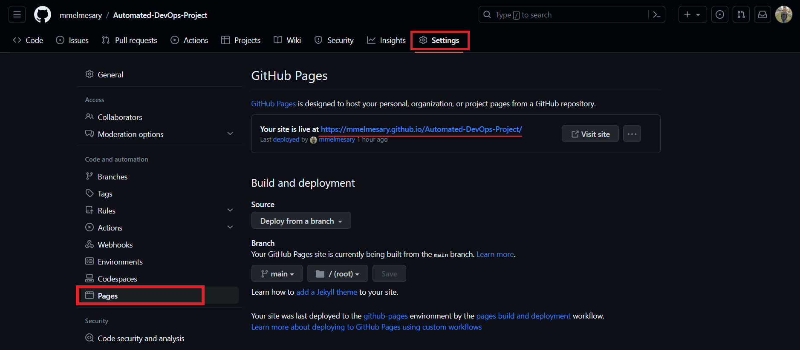
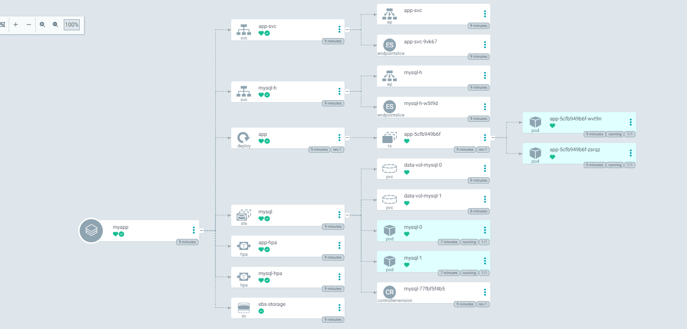

# Automated-DevOps-Project 

## Description

**🚨 This DevOps project showcases how to use :**
- Python Flask RESTful API for MySQL CRUD
- Dockerfile 
- Jenkinsfile 
- docker-compose
- k8s
- Helm charts
- GitHub Pages 
- ArgoCD 

___

## Table of Contents

**`STEP 1`: Create a CRUD Restful Service API using Flask + Mysql**
  - Instructions: [Link to Step 1](https://github.com/mmelmesary/Automated-DevOps-Project/tree/main#step-1-create-a-crud-restful-service-api-using-flask--mysql) 

**`STEP 2`: Dockerize python Application**
  - Instructions: [Link to Step 2](https://github.com/mmelmesary/Automated-DevOps-Project#step-2--dockerized-golang-application) 

**`STEP 3`: Dockerize custom mysql db**
  - Instructions: [Link to Step 3](https://github.com/mmelmesary/Automated-DevOps-Project#step-3--dockerize-custom-mysql-db)

**`STEP 4`: Configure Docker to Run inside Jenkins**
  - Instructions: [Link to Step 4](https://github.com/mmelmesary/Automated-DevOps-Project#step-4-configure-docker-to-run-inside-jenkins)

**`STEP 5`: Define a pipline job using jenkinsfile**
  - Instructions: [Link to Step 5](https://github.com/mmelmesary/Automated-DevOps-Project#step-5-define-a-pipline-job-using-jenkinsfile)

**`STEP 6`: Build the Docker-compose file**
  - Instructions: [Link to Step 6](https://github.com/mmelmesary/Automated-DevOps-Project#step-6-build-the-docker-compose-file) 

**`STEP 7`: Deploying the Application on Kubernetes with Helm**
  - Instructions: [Link to Step 7](https://github.com/mmelmesary/Automated-DevOps-Project#step-7-deploying-the-application-on-kubernetes-with-helm) 

**`STEP 8`: Create Public Helm Chart Repository with GitHub Pages**
  - Instructions: [Link to Step 8](https://github.com/mmelmesary/Automated-DevOps-Project#step-8--create-public-helm-chart-repository-with-github-pages) 

**`STEP 9`: Install & Configure ArgoCD for GitOps Automation**
  - Instructions: [Link to Step 9](https://github.com/mmelmesary/Automated-DevOps-Project#step-9--install--configure-argocd-for-gitops-automation) 

___

## STEP 1: Create a CRUD Restful Service API using Flask + Mysql

In this step, we will build a simple web application using Python Flask that can read from and write to a MySQL database. The main objectives are to:

  - Learn how to build a RESTful web service with Flask.
  - Implement CRUD operations to manage data in a MySQL database.
  - Understand how to connect a Flask application to a MySQL database.

> For the source code, check  [app.py](./src/app.py)

___

## Step 2 : Dockerize python flask Application 

This is a simple Flask application that provides CRUD (Create, Read, Update, Delete) operations for a MySQL database. The application allows you to manage **user information**, including their *name*, *age*, and *job title*. It is designed to be used with a MySQL database, and you can easily configure the necessary environment variables to connect to your desired database instance.

The [Dockerfile](./src/Dockerfile) containes the instrutions how to build and run a flask application using Docker, and it exposes the application on port `5000`.

______ 

 ## Step 3 : Dockerize custom mysql db

The main purpose of this step is to create a custom MySQL Docker image with pre-initialized data. The Docker image is built upon the official MySQL Docker image (mysql:latest), which ensures the latest stable version of MySQL is used.

**Review the [init.sql](./src/init.sql) file:** 

  The init.sql file contains the necessary SQL statements to create the database schema and the table, as well as insert the initial data into the MySQL database. You can customize this file to include your specific data requirements.


The [db.dockerfile](./src/db.dockerfile) containes the instrutions how to build and run a custom mysql db container using Docker.


___

## STEP 4: Configure Docker to Run inside Jenkins

**To be able to run Docker commands from inside the jenkins, you need to have Jenkins installed and install docker-client plugin to run the Docker commands inside Jenkins. Also You'll need to set up your DockerHub credentials in Jenkins**

**First** The [jenkins_with_docker](./src/jenkins_with_docker.dockerfile) file containes all the instructions to use docker-client with jenkins, so try to build an image from that file and then run a container

To build the Jenkins image, run the following command:

```bash
docker build -t melmesary/jenkins:v1.0 -f jenkins_with_docker .
```

To run the Jenkins container, run the following command:

```bash
docker run --name jenkins -p 8080:8080  -it -v /var/run/docker.sock:/var/run/docker.sock -v jenkins_data:/var/jenkins_data melmesary/jenkins:v1.0 bash
```
Run the following command to check that the container is up and running 

```bash
docker ps 
```
Open the Jenkins UI

 >  

> **✨ Contents**, Your Jenkins is now ready to create a job and run the pipline :tada:


**Second** set up your DockerHub credentials in Jenkins

>  


___

## STEP 5: Define a pipline job using jenkinsfile

the [Jenkinsfile](./src/Jenkinsfile) file defines a pipeline job for building the flask app and the custom mysql db containers using the Dockerfile and reporting any errors that occur during the build process.

The pipeline job performs the following steps:

1. Clone the repository and checkout the latest code from the main branch.

1. Build the Docker image using the Dockerfile in the root directory.

1. Check for errors during the build process and report them.

1. Tag the Docker image and push it to DockerHub.


**Running the Pipeline**

1. Create a New Jenkins Job: Create a new Jenkins job and select "Pipeline" as the job type.

1. Configure the Pipeline: Point the job to the repository containing the Jenkinsfile.

1. Run the Pipeline: Trigger the pipeline job to execute the defined steps.

> 

Once the pipeline finishes successfully, you should see something like this:

> 
 

You can also check that the two images pushed successfully to dockerhub


___

## STEP 6: Build the Docker-compose file

**The `docker-compose.yml` file defines a multi-container application that includes two services: a custom MySQL database service and our Flask application service, both of which are containerized and can work together seamlessly.**

 To run the application using Docker Compose, run the following command:

 ```bash
 docker-compose up -d
 ```

 To stop the application, run the following command:

```bash
 docker-compose down 
```
To check the app work correctly , run the following command:

```bash
curl localhost:5000
```
> it should returns an `Hello there!` message

**You can also try to preform some CRUD operations to the db**


___

## STEP 7: Deploying the Application on Kubernetes with Helm

**`Prerequisites`**: deploy an EKS cluster and install `EBS CSI driver` as an Amazon EKS add-on.

To deploy the application on Kubernetes, we'll use **Helm**, a package manager for Kubernetes that simplifies the process of managing and deploying applications. We'll use Helm to install the application, along with the necessary configurations for high availability and volume persistence, and to expose a LoadBalancer service that can be accessed from outside the cluster.


**All of the `Helm manifests` files for the application can be found in the [helm-manifests](./helm-manifests/) directory.**

**To ensure that the application can handle increased traffic and load, we add an `autoscaling manifest` that scales the number of replicas based on resource usage metrics.**
___

# STEP 8: Create Public Helm Chart Repository with GitHub Pages

**1. Packaging the Helm Chart and Signing a Secret Key**


```bash
gpg --quick-generate-key "helm-chart"
gpg --export-secret-keys>  ~/.gnupg/secret.gpg
helm package --sign --key "helm-chart" --keyring  ~/.gnupg/secret.gpg ./helm-manifests
```
**2. Create GitHub Pages**

GitHub Pages is a static site hosting service provided to you by GitHub, designed to host your pages directly from a GitHub repository. GitHub Pages is a perfect match for our purpose, since everything we need is to host a single  `index.yaml` file along with a `.tgz` file.




**3. Create the index.yaml file for the Helm repository** 

```bash
Helm repo index helm-chart --url <github_repository_path>
``` 

**4. Push the code to GitHub repository**

```bash

git add . 

git commit -m "Upload helm-chart" 

git push 
```

___

## STEP 9: Install & Configure ArgoCD for GitOps Automation

 #### First: Install ArgoCD and ArgoCD CLI tool

 **We need to create a namespace for ArgoCD and install it.**

  ```bash
  kubectl create namespace argocd
  kubectl apply -n argocd -f https://raw.githubusercontent.com/argoproj/argo-cd/stable/manifests/install.yaml
  ```
**Check all resources get installed** 

  ```bash
  kubectl get all -n argocd
  ```
**Install ArgoCD CLI**

> You can download the latest Argo CD version from **[the latest release page of this repository](https://github.com/argoproj/argo-cd/releases/tag/v2.7.1)**, which will include the argocd CLI

#### Second: Configuring ArgoCD:
 
  ```bash
  kubectl port-forward svc/argocd-server -n argocd 8080:443
  ```
We must now get our credentials to login.

  ```bash
  kubectl -n argocd get secret argocd-initial-admin-secret -o jsonpath="{.data.password}" | base64 -d
  ```

This secret where the argocd server password is stored is not secure and should be deleted after updating the password with the command below.
  
  ```bash
  argocd account update-password
  ```

#### Third: Deploying our app: 

We will deploy our APP using Helm provided by ArgoCD

```yaml
apiVersion: argoproj.io/v1alpha1
kind: Application
metadata:
  name: myapp
  namespace: argocd
spec:
  project: default
  destination:
    namespace: app-system
    server: 'https://kubernetes.default.svc'
  source:
    repoURL: 'https://mmelmesary.github.io/Automated-DevOps-Project/helm-chart/'
    targetRevision: 0.1.0
    chart: helm-manifests
  syncPolicy:
    automated:
      prune: true
      selfHeal: true
    syncOptions:
    - CreateNamespace=true
```

To deploy our app configuration, run the following command:

```bash
kubectl apply -f argocd-app.yaml
```





**We can check that all the application components are up and running by running the following command**

  ```bash
  kubectl get all -n app-system
  ```

you should see an output like this: 

```
NAME                       READY   STATUS              RESTARTS   AGE
pod/app-5cfb949b6f-wvt9n   1/1     Running             0          2m29s
pod/app-5cfb949b6f-zsrqz   1/1     Running             0          2m29s
pod/mysql-0                1/1     Running             0          13s
pod/mysql-1                0/1     ContainerCreating   0          9s

NAME              TYPE           CLUSTER-IP      EXTERNAL-IP
                   PORT(S)          AGE
service/app-svc   LoadBalancer   10.100.58.102   a7fd03b3d6ee44b058d3418d4baa167f-823608265.us-east-1.elb.amazonaws.com   5000:30878/TCP   2m29s
service/mysql-h   ClusterIP      None            <none>
                   3306/TCP         2m29s

NAME                  READY   UP-TO-DATE   AVAILABLE   AGE
deployment.apps/app   2/2     2            2           2m30s

NAME                             DESIRED   CURRENT   READY   AGE
replicaset.apps/app-5cfb949b6f   2         2         2       2m30s

NAME                     READY   AGE
statefulset.apps/mysql   2/2     2m30s

NAME                                            REFERENCE           TARGETS         MINPODS   MAXPODS   REPLICAS   AGE
horizontalpodautoscaler.autoscaling/app-hpa     Deployment/app      <unknown>/70%   1         3         2          2m30s
horizontalpodautoscaler.autoscaling/mysql-hpa   StatefulSet/mysql   <unknown>/70%   1         3         2          2m30s
```

**Access the application using frontend-external service `loadbalancer`**

```bash
kubectl get svc app-svc -n instabug-system -o jsonpath="{.status.loadBalancer.ingress[0].hostname}"
```

